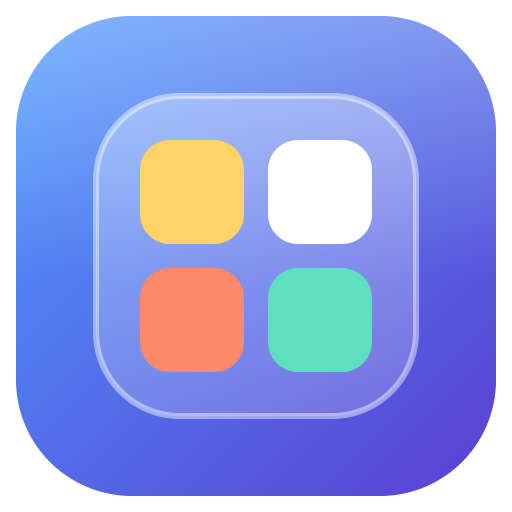

<p align="center">
  
</p>

<h1 align="center">DeskPockets</h1>

<p align="center">
  Windows masaüstünüzü iOS tarzı gruplarla düzenleyin.<br />
  <sub>Geliştiren: <b>vadiSoft</b></sub>
</p>

<p align="center">
  <a href="https://github.com/vadisoftcomtr/DeskPockets/releases/latest"><b>⬇ Son sürümü indir</b></a>
  &nbsp;·&nbsp; Windows 10 / 11 (64-bit)
</p>

---

## Özellikler

- Masaüstü dosya, klasör ve programlarını renkli gruplarda toplar; masaüstü tertemiz kalır.
- **Otomatik gruplama:** Resimler, Belgeler, Programlar, Klasörler… tek tıkla.
- Grupların içinde resimlerin üzerine gelince tam boy önizleme.
- Grup başına renk teması ve ikon boyutu.
- Sürükle-bırak ile gruplara ekleme, yumuşak yerleşim.
- **Sıfırla:** Tüm grupları dağıtıp dosyaları masaüstüne döndürme ve geri alma.
- Dosyalarınız **asla silinmez**; programdan çıkınca, Windows kapanırken ya da program kaldırılınca eski yerlerine döner.

## Kurulum

1. [Releases](https://github.com/vadisoftcomtr/DeskPockets/releases/latest) sayfasından **`DeskPockets-Kurulum-x.y.z.exe`** dosyasını indirin.
2. Dosyayı çalıştırın, dil seçin (varsayılan Türkçe), lisansı kabul edip **Kur** deyin.
3. Program `C:\Program Files\vadiSoft\DeskPockets` klasörüne kurulur; Windows bir kez yönetici onayı ister.

### Windows veya antivirüs uyarı verirse

DeskPockets yeni ve henüz dijital imzası olmayan bir program olduğu için bazı güvenlik yazılımları
ilk çalıştırmada **ihtiyaten** uyarı gösterebilir. Bu, programın zararlı olduğu anlamına gelmez;
sadece daha önce yeterince bilgisayarda görülmediğini gösterir.

**Windows SmartScreen — "Windows bilgisayarınızı korudu"**
1. **Ek bilgi**'ye tıklayın.
2. Yayımcı/uygulama adının `DeskPockets-Kurulum` olduğunu kontrol edin.
3. **Yine de çalıştır**'a tıklayın.

**Avast / AVG — "şüpheli dosya", "sanal alanda çalıştırılıyor" ya da kurulumda "Dosya yazmak için açılırken hata"**

Avast kurulum programını sanal alanda (sandbox) çalıştırırsa program diske yazamaz ve kurulum hata verir. Bu durumda:
1. Kurulumu **Durdur** ile kapatın.
2. Avast'ı açın: **Menü → Ayarlar → Genel → İstisnalar → İstisna ekle**.
3. İndirdiğiniz `DeskPockets-Kurulum-x.y.z.exe` dosyasını seçin (ya da yolunu yapıştırın) ve kaydedin.
4. Kurulum dosyasını yeniden çalıştırın.

Avast uyarı penceresinde doğrudan **"Çalıştır"** / **"Güvenilir olarak işaretle"** seçeneği çıkarsa onu da seçebilirsiniz.

> Antivirüsünüzü tamamen kapatmanıza gerek yoktur; yalnızca bu kurulum dosyasına izin vermeniz yeterlidir.

### İndirdiğiniz dosyanın orijinal olduğunu doğrulayın

Her sürümün notlarında kurulum dosyasının **SHA-256** özeti yazılıdır. PowerShell'de:

```powershell
Get-FileHash "$env:USERPROFILE\Downloads\DeskPockets-Kurulum-*.exe" -Algorithm SHA256
```

Çıkan değer sürüm notlarındakiyle **birebir aynıysa** dosya değiştirilmemiştir. Farklıysa dosyayı
çalıştırmayın ve yalnızca bu sayfadaki Releases bölümünden yeniden indirin.

## Gizlilik ve güvenlik

- İnternete bağlanmaz; kişisel veri, kullanım istatistiği veya dosya içeriği **toplamaz**.
- Ayarlar yalnızca bilgisayarınızda (`%APPDATA%\DeskPockets`) saklanır.
- Uygulama yönetici yetkisi olmadan çalışır; arayüzü izole (sandbox) ortamda ve sıkı güvenlik politikasıyla çalışır.
- Yalnızca sizin DeskPockets'e eklediğiniz dosyaları açabilir.

## Kaldırma

**Ayarlar → Uygulamalar → Yüklü uygulamalar → DeskPockets → Kaldır.**
Gruplardaki tüm dosyalar masaüstüne geri konur, masaüstü ikonları yeniden görünür.

## Lisans

DeskPockets ücretsiz dağıtılan, kaynak kodu kapalı bir yazılımdır. Ayrıntılar: [LICENSE.md](LICENSE.md)

© 2026 vadiSoft. Tüm hakları saklıdır.

---

## English

**DeskPockets** organizes your Windows desktop into iOS-style groups. Developed by **vadiSoft**.

**Install:** download `DeskPockets-Kurulum-x.y.z.exe` from [Releases](https://github.com/vadisoftcomtr/DeskPockets/releases/latest),
run it and choose *English* in the language dialog. It installs to `C:\Program Files\vadiSoft\DeskPockets`.

**If Windows or your antivirus warns you:** the installer is new and not yet code-signed, so some security tools
show a precautionary warning on first run.
- *SmartScreen:* click **More info → Run anyway**.
- *Avast / AVG:* if the installer reports "Error opening file for writing", Avast is running it in its sandbox.
  Stop the installer, add the downloaded file under **Menu → Settings → General → Exceptions**, then run it again.

**Verify the download:** compare `Get-FileHash <file> -Algorithm SHA256` with the SHA-256 value in the release notes.

**Privacy:** no internet connection, no data collection. Your files are never deleted and are moved back to the
desktop when the app quits, Windows shuts down or the app is uninstalled.
